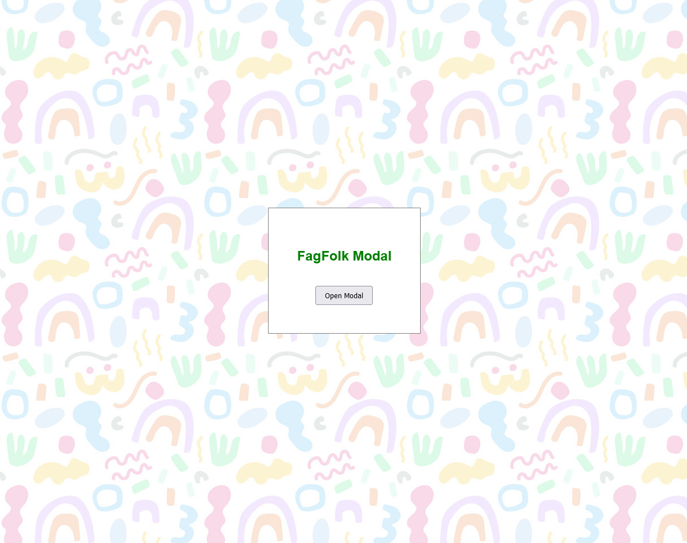
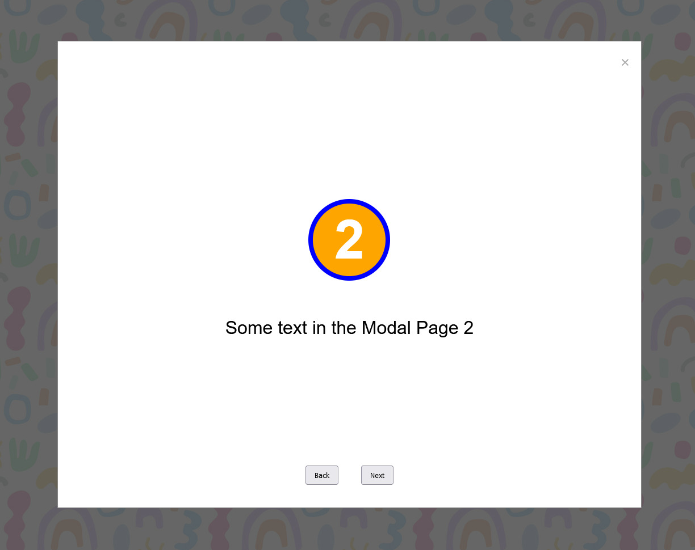
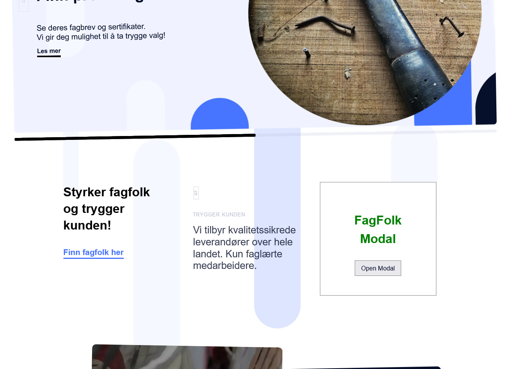
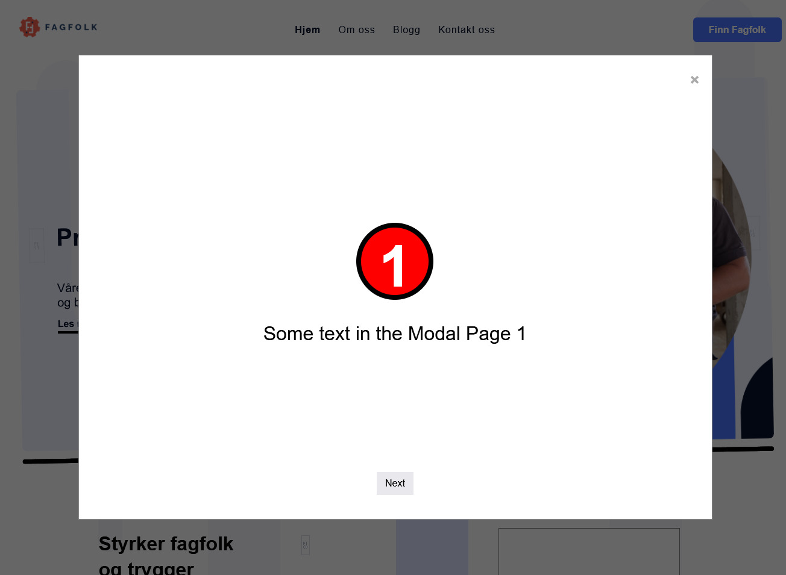

    <h1>FagFolk module in modal window</h1>
    <h3>
        <a href="https://chriskodehub.github.io/fagfolk-modal-window-mvc">
            Live demo
        </a>
         | 
        <a href="https://github.com/chriskodehub/fagfolk-modal-window-mvc">
            GitHub
        </a>
    </h3>
    
Application supporting the acquisition of new customers

         
        
Technologies and tools:

    

        
        
        
        
        
        
        
    

 

## About project

The task I have undertaken is to create a module that opens in a modal window on any page where its code will be inserted.

The biggest challenge is to create a code that is 100% transparent for the systems in which the module will be used so that there is no undesirable interference between the module and the generated page.

### Test 1 - simple test page

### Test 2 - FagFolk.net page

## About me

Hello. My name is Krzysztof. I am looking for a job on an interesting and developing project. I am a person who **likes challenges**. I have just started my adventure in the programming industry. I study intensively and experiment with **my projects**. I invite you to [my portfolio](https://chriskodehub.github.io/portfolio/). 

